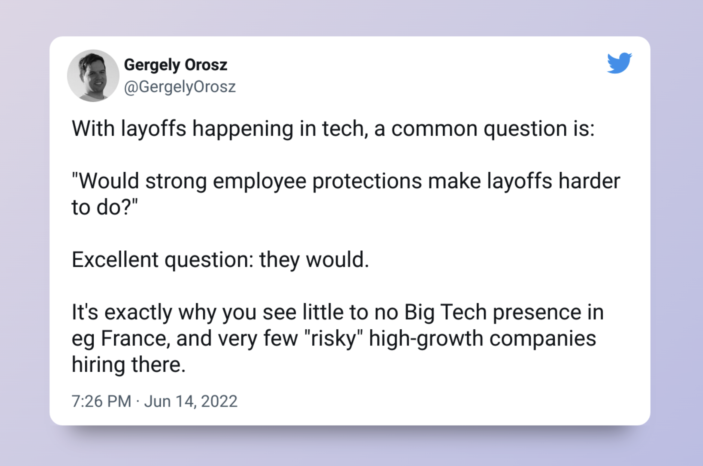

I was laid off at Spotify in the 6% workforce reduction [announced](https://techcrunch.com/2023/01/23/spotify-cuts-6-of-its-workforce-impacting-600-people) on January 23rd, 2023. It was a very tough day for a lot of the "bandmates" (this is what Spotify likes to call their employees) and I got to know that I was affected by checking my emails first thing in the morning after only two months of working there (the hiring process took almost longer than the time I was employed there 😅). The subject of the mail was **HR Org Update** and after reading the short paragraph of the invitation I knew what was coming.

It was always a dream of mine to work at a company like Spotify. For one, it's a nice product, that I've been using for almost 7 years now. Everybody I know has a Spotify subscription and uses it every day.

Their [engineering culture](https://www.youtube.com/watch?v=4GK1NDTWbkY) is amazing, and I've felt that from day one of working there. You get onboarding by going through a week-long boot camp, that teaches you not only [Backstage](https://backstage.io/) but also connects you with a lot of the new engineers through working on the assignment together. Till that point, I had never experienced such a diverse group of people, coming from all over the world. When beginning to finally work in my home squad, which was responsible for Content Reporting, I was really overwhelmed at first. It's _a lot_ to process these first weeks at Spotify, from video lectures on how the business operates, to the domain that your squad is responsible for. It was a vibrant experience, with a lot of cross-squad collaboration right from the get-go. I had weekly 1:1s with my EM and started working on projects soon.

The layoff hit me hard. For anyone who's not gone through something like this, it's hard to express how it feels. An emotional rollercoaster, that starts with "this is not too bad, I've got into Spotify, I'll find another job very soon" goes to "I'm the biggest loser there is" and finally... well acceptance. It's kind of like the [Five stages of grief](https://en.wikipedia.org/wiki/Five_stages_of_grief) that one goes through, and I cannot recommend it at all. I tried to understand _why_ this is happening, and IMO this is the hardest thing about it. There is an [article in The Verge](https://www.theverge.com/2023/1/26/23571659/tech-layoffs-facebook-google-amazon) that argues about the _Revenue per employee_ KPI that is being raised by layoffs quickly. I don't understand enough of the causal chain that leads to bigger layoffs to judge this point, but this reasoning makes the most sense to me.

No matter why it happened or how it happened, how did this experience impact me? I, like so many, always wanted to work for Big Tech. The salary is great, you work on hard problems, you are surrounded by experts in your field and you learn a lot from day one. I still think that Spotify is and will be a great place to work in the future. But I fight with myself to answer this question: **"Would I ever go back to Spotify?"** I had a plan laid out for the next couple of years, that got destroyed in a matter of a day. And I have to say, I still don't know where this journey will lead me now, but I try and stay open-minded. I applied and interview at the moment everywhere from small startups to pink European tech companies.

So, what did I learn from all this?

**1. I cannot rely on staying employed**

This is a bitter medicine to swallow, but there is just no guarantee that you will stay at the place where you are now. People that [worked for two decades](https://www.linkedin.com/posts/jcjoslin_after-nearly-20-years-at-google-i-find-out-activity-7022209038633353216-nxXm) are let go via an email. It can be over in a matter of seconds and what do you do then? It teaches me that I need to constantly be aware of the possibilities around me, stay in touch with the job market, keep my resume up-to-date, keeping a [brag document](https://www.youtube.com/shorts/gbkv8Asadh0) handy at all times.

**2. Having multiple sources of income**

I want to generate income from more than just my work labour. I love my profession and I love working in teams to build great products. To be financially safe though, I need one or more side business that in an unfortunate event helps me and my family entertain (at least parts of) our lifestyle and basic needs.

**3. Unionize!**

At Spotify, the formation of unions is in full swing after the layoffs and people are fighting back in Sweden, Germany, the Netherlands, etc. I never thought of worker unions before, and if I did it was always with a touch of distaste for them (I don't even know why), but I saw how important they are in these situations. Sure, they contribute to a kind of bureaucratic environment but it doesn't seem to have an [impact on innovation](https://www.erudit.org/en/journals/ri/2010-v65-n4-ri3998/045585ar). So, unionize where you can!

--

Thanks for reading! I am just getting started with writing as a way to learn and grow. If you have feedback for me on that, I'd be more than happy to hear it :) [DM me on Twitter](https://twitter.com/eneskaya)
